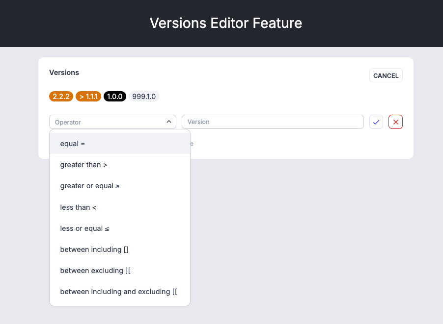
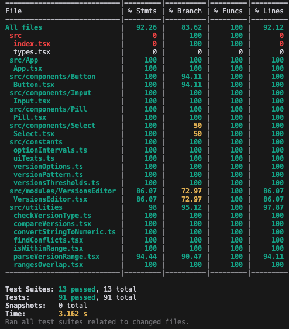

## Version Editor UI
### Video presentation
[Click here](https://www.loom.com/share/118b571cefed4a6da6aa515a3b4c3498?sid=3fd03ff2-5655-49f7-adad-7dbc5c6ef750) to see the **_Video Presentation_**

### Screenshot


### Frontend stack

- [React](https://reactjs.org/)
- [Tailwind](https://tailwindcss.com/)

### Build & development stack

- [TypeScript](https://www.typescriptlang.org/)
- [ESLint](https://eslint.org/)
- [Testing Library](https://testing-library.com/docs/react-testing-library/intro/)


## Setup

### Requirements

1. Install [Node.js](https://nodejs.org/) v18 (or newer)
2. Install [NPM](https://www.npmjs.com/)
3. Install the project dependencies by running `npm install`.

## Available Scripts

These are the main commands you'll need to execute to develop the application.

| Command                  | Description                                                       |
| ------------------------ | ----------------------------------------------------------------- |
| `npm start`              | Start a new local development server on [http://localhost:3000]() |
| `npm test`               | Run Jest                                                          |
| `npm run test:coverage`  | Run Jest and get test coverage                                    |


### Implementation desscription:
1. Initial state:
   - The title "Versions" is displayed.
   - The "Add version" button is displayed.
   - The message "No versions added yet" is displayed.

2. Start/Cancel "Add version":
   - The user clicks the button "Add version", its label changes to "Cancel" and a "Select input" and an "Input field" and a "Save button" and "Delete button" appear and the message "No versions added yet" is hidden.
   - The user clicks the "Cancel" button, the input fields are hidden and the button label changes back to "Add version".

3. Create a version:
   - The user selects an Operator and types a Version number and clicks the "Save" button:
     - if the combination of Operator/Version value was added before, the version is NOT added to the list of versions and the "This version with the same option already exists." error message is displayed.
     - if the combination of Operator/Version value was NOT added before, the version is added to the list of versions.
   - The user clicks the "Delete" button and the process is canceled.
   - If there is at least one version added, the message "Click on version chip to get options to edit and delete" is displayed.
   - The added version takes different styling depending on the version type ("Test" or "Production"). The type is defined by the version's value. If it is higher than "999.0.0", the version's type is "Test". Otherwise, it is "Production".

4. Deleting a version:
   - The user clicks on the "version chip" and the "Save button", the "Delete button", the "Select input" and the "Input field" are displayed. Both input fields are filled with the version's respective Operator and Value.
   - The user clicks the "Delete" button, the version is removed from the list of versions.
   - After the delete operation is completed, if there are no versions added, the message "No versions added yet" is displayed again, otherwise the message "Click on version chip to get options to edit and delete" is displayed.

5. Editing a version:
   - The user clicks on the "version chip" and the "Save button", the "Delete button", the "Select input" and the "Input field" are displayed. Both input fields are filled with the version's respective Operator and Value.
   - The user changes the Operator and/or the Value and clicks the "Save" button:
     - if the combination of Operator/Version value was added before, the version is NOT updated in the list of versions and the "This version with the same option already exists." error message is displayed.
     - if the combination of Operator/Version value was NOT added before, the version is updated in the list of versions.
   - The user clicks the "Delete" button, the version is removed from the list of versions.
   - The user can also click the "Cancel" button, and the process is canceled.

6. Checking for overlaps or conflicting "version intervals":
    - A function with logic to check if there are "version intervals" that overlap or conflict with each other is implemented. If there are, the "version chip" of the overlap or conflict versions is highlighted.
    - The check only compares the "version intervals" of the versions that have the same types of version ("Test" or "Production").
    - Examples of overlapping/conflicting version intervals:
      - Production versions: ```"≥ 1.0.0" and "[ 1.5.0 - 3.0.0 ]"```; ```"] 1.0.0 - 2.0.0 [" and "[ 1.5.0 - 3.0.0 ["```
      - Test versions: ```"> 999.1.0" and "999.2.0"```; ```"[ 999.1.0 - 999.6.0 [" and "] 999.2.0 - 999.8.0 ["```

7. Validating versions values:
    - Versions values should follow the pattern: ```/^\d{1,3}\.\d{1,3}\.\d{1,3}$/```
    - Consider that ```1.1.1``` is the same as ```001.001.001```
    - Examples of valid versions values: ```1.0.0```, ```999.0.0```, ```999.999.999```

### Test coverage


